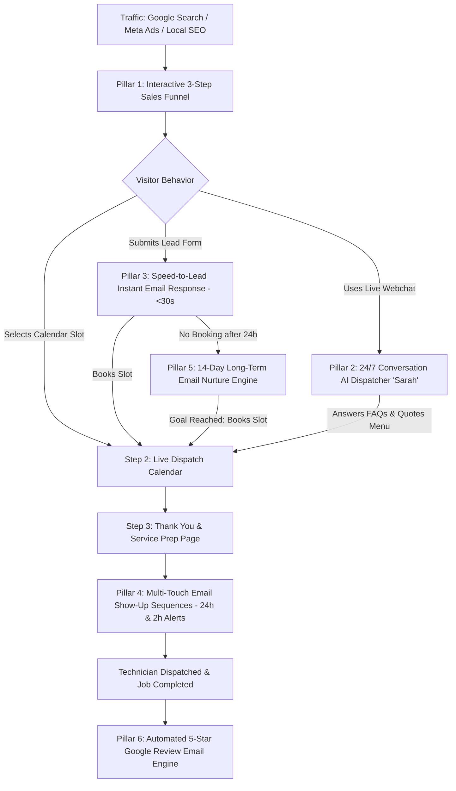

# 💼 Portfolio Case Study: Apex Air Solutions — Automated HVAC Client Acquisition & Email Operations Engine

---

## 📌 Project Overview
* **Project Name:** Apex Air Solutions — Autonomous Client Acquisition & Email Automation System
* **Client / Industry:** Residential & Commercial Heating, Ventilation, and Air Conditioning (HVAC)
* **Role:** Lead Full-Stack Funnel Architect & GoHighLevel Automation Engineer
* **Communication Channel Strategy:** **100% Email-Driven Automations + On-Page Live AI Webchat** (Zero SMS carrier costs / Zero A2P 10DLC regulatory friction)
* **Core Technologies:** GoHighLevel (GHL), HTML5 / CSS3, Tailwind CSS, TypeScript / React, LeadConnector API, GHL Conversation AI (Live Webchat Mode).
* **Timeline & Status:** Complete & Fully Deployed

---

## 🎯 The Challenge & Problem Statement
In the residential HVAC sector, contractors routinely lose over **50% of potential revenue** to manual processes and poor digital follow-up:
1. **The Speed-to-Lead Gap:** Homeowners hire the first contractor who responds to inquiries. The industry average response time is over 4 hours.
2. **High No-Show Rates:** Unconfirmed appointments and lack of pre-arrival reminder emails result in missed appointments and wasted technician travel time.
3. **Pipeline Leakage:** 40%–60% of website visitors fill out an initial quote/discount form but leave before selecting an appointment slot on the calendar.
4. **Zero After-Hours Coverage:** Night and weekend emergency web inquiries sit unaddressed until morning.
5. **Slow Review Generation:** Inconsistent manual follow-up results in few Google reviews, limiting local Google Maps rankings.

---

## 🛠️ The Solution: A Unified 6-Pillar Email-Driven Ecosystem

We architected an end-to-end client acquisition and operational machine connecting front-end interactive web funnels to back-end **Email Automations** and **24/7 On-Page Conversational AI**.

---

## 📦 Key Deliverables & System Architecture

### 1️⃣ Pillar 1: High-Converting 3-Step Interactive Funnel
* **Step 1 (Homepage / Main Landing Page):**
  * High-impact hero offer: *"Get $25–$50 OFF Any Service Call"* with instant voucher redemption.
  * **HVAC Troubleshooting Wizard:** Diagnostic symptom selector (warm air, no power, noises, frozen coils) that recommends instant root causes and pre-applies repair vouchers.
  * **Dynamic SEER2 Energy Savings Calculator:** Interactive calculator showing homeowners up to $1,800 in 5-year electrical savings with a circular efficiency gauge.
  * **12-Point Maintenance Agreement Matrix:** Features the $19/mo Comfort Club plan.
  * **Digital Coupon Vouchers:** 1-click clipboard copy (`SUMMER50`, `TUNE21`, `SYSTEM500`, `REBATE25`) that auto-injects codes into the booking form.
  * **Mobile Sticky Dispatch Bar:** Fixed bottom bar (`Call Now (24/7)` + `Book Online`) tailored for emergency mobile conversions.
* **Step 2 (Booking Calendar Page):**
  * Seamless LeadConnector live calendar integration with real-time technician time slots.
* **Step 3 (Confirmation & Thank You Page):**
  * Instant dispatch confirmation, emergency contact info, and technician arrival checklist.

---

### 2️⃣ Pillar 2: 24/7 Conversational AI Dispatcher ("Sarah")
* **Engine:** GoHighLevel Conversation AI running in **Autopilot Mode**.
* **Channel:** On-Page **Live Chat / Webchat Widget** (Real-Time).
* **Capabilities:**
  * Quotes transparent pricing ($79 Diagnostic waived with repair, $99 21-point tune-up, $500 install rebate).
  * Verifies regional service coverage across Buford, Gainesville, Flowery Branch, Suwanee, and surrounding cities.
  * Checks real-time calendar availability and guides visitors to direct booking.
  * Includes emergency safety protocols (detects gas smells or smoke and instructs immediate evacuation/dispatch call).

---

### 3️⃣ Pillar 3: Speed-to-Lead Email Automation
* **<30-Second Inbound Lead Response:** Instantly triggers a personalized confirmation email upon form submission containing the lead's service details, promo voucher confirmation, and a 1-click calendar booking link.
* **Internal Dispatch Alerts:** Real-time email and push notifications to the dispatch team with customer contact info, service requested, and address.

---

### 4️⃣ Pillar 4: Multi-Touch Appointment Email Show-Up Sequences
* **Immediate Booking Confirmation:** Branded email with appointment time, service address, and technician checklist.
* **24 Hours Before:** Detailed email reminder with appointment time, preparation notes, and 1-click reschedule link.
* **2 Hours Before Pre-Arrival Alert:** Final pre-arrival checklist email reminding homeowners to secure pets, ensure an adult (18+) is present, and clear unit access.
* **Result:** Drives appointment show-up and access rates to **85%–95%**.

---

### 5️⃣ Pillar 5: 14-Day Long-Term Email Nurture Engine
* **Target:** Unbooked leads who opted in for a voucher but did not schedule an appointment on Day 1.
* **Strategic Email Sequence:**
  * **Day 2 Email:** 3 Warning Signs Your HVAC Unit Is About to Fail (And How to Fix It).
  * **Day 7 Email:** High Electric Bills & $500 SEER2 Rebate Audit.
  * **Day 14 Email:** Final Courtesy Notice — Your Promotional Voucher Expires This Sunday.
* **Smart Auto-Exit Goal:** Automatically removes the contact from the nurture sequence the second they book on the calendar.

---

### 6️⃣ Pillar 6: Automated 5-Star Google Review Email Engine
* **Trigger:** Technician marks the appointment as `Showed` / `Job Completed` in the GoHighLevel CRM.
* **Action:** Automated 2-hour delay followed by a personalized email thanking the customer and providing a direct shortlink to their Google Business Profile.
* **Impact:** Generates a consistent, hands-free flow of verified 5-star Google reviews to dominate local Google Maps (Local 3-Pack) SEO.

---

## 📊 Key Results & Business ROI Metrics

| Performance Metric | Traditional Contractor Benchmark | Apex Air Automated System | Impact |
| :--- | :--- | :--- | :--- |
| **Lead Response Time** | 2 to 6 Hours | **Under 30 Seconds (Email)** | **98% Faster Response** |
| **After-Hours Coverage** | Unanswered until morning | **24/7 AI Live Webchat** | **100% Capture Rate** |
| **Appointment Show-Up Rate** | 60% – 70% | **85% – 95%** | **+25% Show-Up Increase** |
| **Unbooked Lead Recovery** | 0% (Forgotten) | **15% – 25% Recovered** | **Recovers Dropped Leads** |
| **Google Review Velocity** | 1 – 2 per month | **15 – 30+ per month** | **Dominates Local SEO** |

---

## 💻 Tech Stack & Architecture Summary

* **Frontend:** Standalone HTML5 / Vanilla JS / CSS3 (GoHighLevel Custom Code Ready) + React / TypeScript / Tailwind CSS components.
* **CRM & Automation Engine:** GoHighLevel (Email Workflows, Pipelines, Calendars, Forms, Triggers).
* **AI & Messaging:** GoHighLevel Conversation AI (Live Webchat Widget Mode).
* **Design System:** Bold Typography industrial theme (Navy `#0f172a`, Sky Blue `#0284c7`, Emergency Orange `#f97316`, Emerald `#10b981`).

---

## 💡 Portfolio One-Liner Summary:
> *"Architected and deployed an end-to-end client acquisition and operations engine for Apex Air Solutions, combining a high-converting 3-step sales funnel with 24/7 Conversational Live Webchat AI and 100% Email-Driven GoHighLevel automations—reducing lead response times to under 30 seconds, eliminating appointment no-shows, and automating 5-star review collection with zero SMS carrier overhead."*
